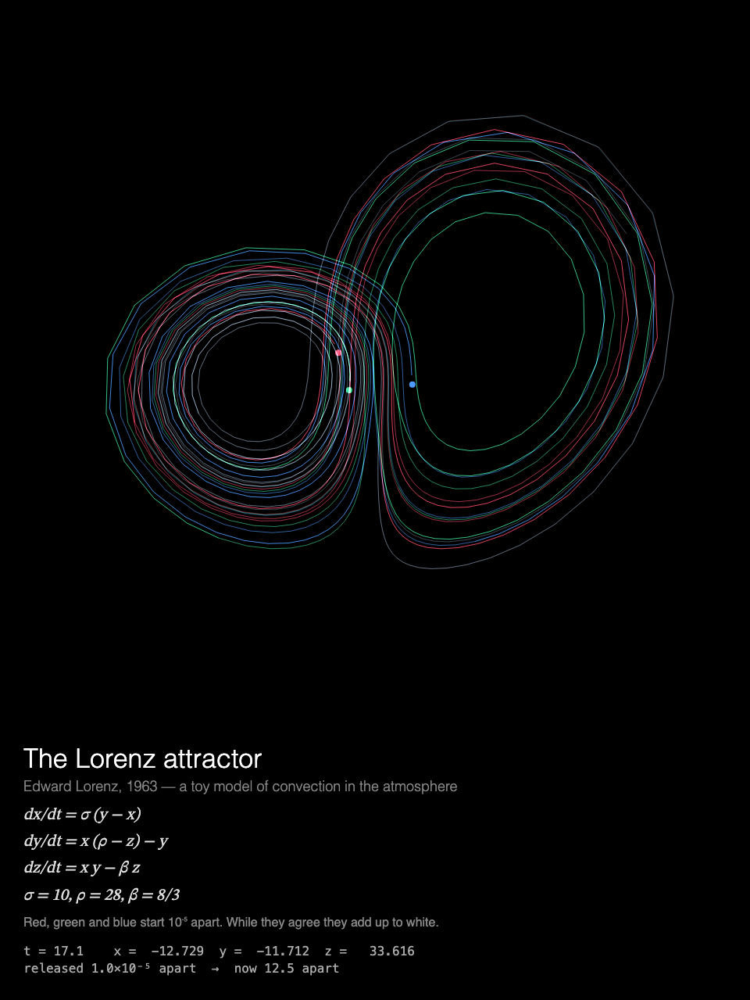

# MMM-LorenzAttractor

A [MagicMirror²](https://magicmirror.builders/) module that traces the Lorenz attractor with three trajectories released 10⁻⁵ apart, drawn for a Raspberry Pi without a GPU.



## What you see

**The Lorenz attractor.** Three trajectories released 10⁻⁵ apart trace the butterfly as one
white line, then split into red, green and blue, while the view turns slowly in 3D. Or, with
`lorenzStyle: "exposure"`, a fixed view in which the paths build up like a long-exposure
photograph: the loops the three share glow white, and the often-visited ones grow brighter.

Under the butterfly: Lorenz's equations and parameters, and a readout of the time, the position
of one trajectory, and how far apart the three have drifted since they were released. New
trajectories start every `cycleSeconds`, and each time the module is shown again.

Built for a **Raspberry Pi 3 without GPU acceleration**: everything is drawn by the CPU, so the
drawing is designed around what that costs, and the animation stops completely while the module
is hidden (see [Performance](#performance)).

## Installation

```bash
cd ~/MagicMirror/modules
git clone https://github.com/charleswest775/MMM-LorenzAttractor
```

No npm dependencies: there is nothing to install.

## Update

```bash
cd ~/MagicMirror/modules/MMM-LorenzAttractor
git pull
```

## Configuration

```js
{
	module: "MMM-LorenzAttractor",
	position: "middle_center",
	config: {
		lorenzStyle: "rotate",
		width: 900,
		height: 900,
		fps: 20
	}
},
```

| Option | Default | Description |
|---|---|---|
| `lorenzStyle` | `"rotate"` | `"rotate"`: fading trails, the view turning in 3D. `"exposure"`: fixed view, trails build up like a long-exposure photograph. About a third of the CPU on a Pi |
| `cycleSeconds` | `60` | Release new trajectories this often; new ones are also released each time the module is shown again |
| `width`, `height` | `900` | Canvas size in pixels |
| `fps` | `20` | Frame-rate cap |
| `showMath` | `true` | Equations and live numbers under the canvas |
| `turns` | `null` | Take turns with other modules on the same page, e.g. `{ of: 2, at: 1 }` (see [Taking turns](#taking-turns)) |
| `statsPanel` | `false` | A line under the math showing what the mirror spends: fps, CPU of Electron and the compositor, a bar per core, temperature, and the time to the next release. Sampled by the module's `node_helper` from `/proc`, only while the module is shown |
| `debugStats` | `false` | Show achieved fps and per-frame timings in the corner of the screen |

## Taking turns

With `turns: { of: n, at: k }`, modules on the same [MMM-pages](https://github.com/edward-shen/MMM-pages)
page each show on their own one in n showings of it: `at: 0` on the first showing and every
nth after it, `at: 1` on the second, and so on. A module that isn't on its turn takes no room on
the page and costs nothing: it hides its canvas and doesn't start. So one slot in the rotation
can hold several pages, without making the rotation longer. For example, the Lorenz attractor,
[MMM-DoublePendulum](https://github.com/charleswest775/MMM-DoublePendulum)'s pendulums and
[MMM-ThreeBody](https://github.com/charleswest775/MMM-ThreeBody)'s three bodies, one per showing:

```js
{
	module: "MMM-LorenzAttractor",
	classes: "page-chaos",
	position: "middle_center",
	config: { turns: { of: 3, at: 0 } }
},
{
	module: "MMM-DoublePendulum",
	classes: "page-chaos",
	position: "middle_center",
	config: { turns: { of: 3, at: 1 } }
},
{
	module: "MMM-ThreeBody",
	classes: "page-chaos",
	position: "middle_center",
	config: { turns: { of: 3, at: 2 } }
},
{
	module: "MMM-pages",
	config: { modules: [["page-clock"], ["page-chaos"]], rotationTime: 60000 }
},
```

Without `turns` the module shows every time. It works just as well on a page of its own, or in
a normal region without MMM-pages, where it releases new trajectories every `cycleSeconds`.

## What's real

The equations are Lorenz's of 1963, a toy model of convection in the atmosphere, with his
parameters σ = 10, ρ = 28, β = 8/3 (`simulations/lorenz.js`). They are integrated by the
fourth-order Runge–Kutta method at a fixed step of 0.004, and run at 0.55 of the model's time
units per second, in fixed substeps, so the model's time keeps pace with real time however the
frames fall. Each release starts on the attractor: from (1, 1, 20) the model first runs for a
random 20–40 time units, so the transient has died away and the butterfly is joined at a random
place along it. There three trajectories are released, 10⁻⁵ apart in x.

Each keeps its last 1400 points, one every third step. The view turns about the z axis, once
in about 50 s, tilted by 0.35 rad. The three are drawn additively in red, green and blue, so
while they agree they add up to white; as they part, the colours appear. The readout shows the
model's time, x, y and z of the first trajectory, and the largest distance between the three.

The tests check the equations and the integrator against known results: that the fixed points
C± = (±√(β(ρ−1)), ±√(β(ρ−1)), ρ−1) are equilibria, that a trajectory stays on the bounded
attractor for 200 time units, that the largest Lyapunov exponent comes out at ≈ 0.906 (by
Benettin's renormalisation), that trajectories 10⁻⁹ apart end up attractor-sized distances
apart, and that the module's three are still within 10⁻² of each other after 5 s and more
than 1 apart after 60 s.

## Performance

Measured on a Raspberry Pi 3 B+ (Electron 42, software rendering), 900×900 at 20 fps, as CPU
of the Electron processes plus the `cage` compositor over 60 s, in % of one core (the Pi has
four); baseline mirror without the module: 0.2%.

| | % of one core | achieved fps |
|---|---|---|
| module **hidden** (e.g. another MMM-pages page) | 0.3 | 0 |
| `lorenzStyle: "rotate"` | 165 | 16 |
| `lorenzStyle: "exposure"` | 55 | 20+ |

In the turning view the whole butterfly moves every frame, and the Pi's renderer is saturated:
it reaches 16 fps, and its CPU stays near 150% whatever `fps` is set to. The long exposure only
adds what is new, so it keeps up at a third of the cost.

Why it costs what it does, from micro-benchmarks on the Pi:

- There is no GPU acceleration to be had (the Pi 3's GPU only does GLES 2.0; Chromium needs
  3.0), so every pixel is drawn by the CPU.
- Any frame that changes the canvas costs ~2% of a core per fps, before drawing anything.
- On top of that, cost grows with the **area that changes**: Chromium redraws the bounding box
  of everything touched in a frame. So the turning view projects every point first and clears
  only the box around this frame's and the last frame's curves, and draws 1 px lines (twice the
  frame rate of 1.6 px lines); the long exposure draws only the segments since the last frame.
- JavaScript is not the bottleneck: step and draw take 0.1–3 ms per frame.
- The frame loop sleeps with `setTimeout` until a frame is due. While MagicMirror² fades the
  module out, nothing new is drawn; once it is hidden, the loop stops.

## Development

```bash
node --test              # physics checks (no dependencies)
python3 -m http.server   # then open http://localhost:8000/dev/preview.html
```

`dev/preview.html` runs the module outside MagicMirror², in a portrait 1200×1920 frame, with
hide/show buttons that follow MagicMirror²'s suspend/resume order. Query options override the
config, e.g. `?lorenzStyle=exposure` or `?fps=30&statsPanel=true`.

The tests check the physics against known results rather than looks: the fixed points, the
bounded attractor, the Lyapunov exponent (≈ 0.906), sensitive dependence, and that the module's
three trajectories start together and part within a showing.

## License

MIT

Part of a family of MagicMirror² modules. The chaos:
[MMM-ChaosTheory](https://github.com/charleswest775/MMM-ChaosTheory) (all eight in one),
[MMM-DoublePendulum](https://github.com/charleswest775/MMM-DoublePendulum),
[MMM-FractalBasins](https://github.com/charleswest775/MMM-FractalBasins),
[MMM-LogisticMap](https://github.com/charleswest775/MMM-LogisticMap),
[MMM-SymmetricIcons](https://github.com/charleswest775/MMM-SymmetricIcons),
[MMM-ThreeBody](https://github.com/charleswest775/MMM-ThreeBody),
[MMM-ChaoticBilliards](https://github.com/charleswest775/MMM-ChaoticBilliards) and
[MMM-Rule30](https://github.com/charleswest775/MMM-Rule30).
And more:
[MMM-Atom](https://github.com/charleswest775/MMM-Atom),
[MMM-FractalZoom](https://github.com/charleswest775/MMM-FractalZoom),
[MMM-Chladni](https://github.com/charleswest775/MMM-Chladni),
[MMM-SacredGeometry](https://github.com/charleswest775/MMM-SacredGeometry),
[MMM-Tilings](https://github.com/charleswest775/MMM-Tilings),
[MMM-PlanetsDance](https://github.com/charleswest775/MMM-PlanetsDance),
[MMM-SnowCrystal](https://github.com/charleswest775/MMM-SnowCrystal) and
[MMM-NightSky](https://github.com/charleswest775/MMM-NightSky).
